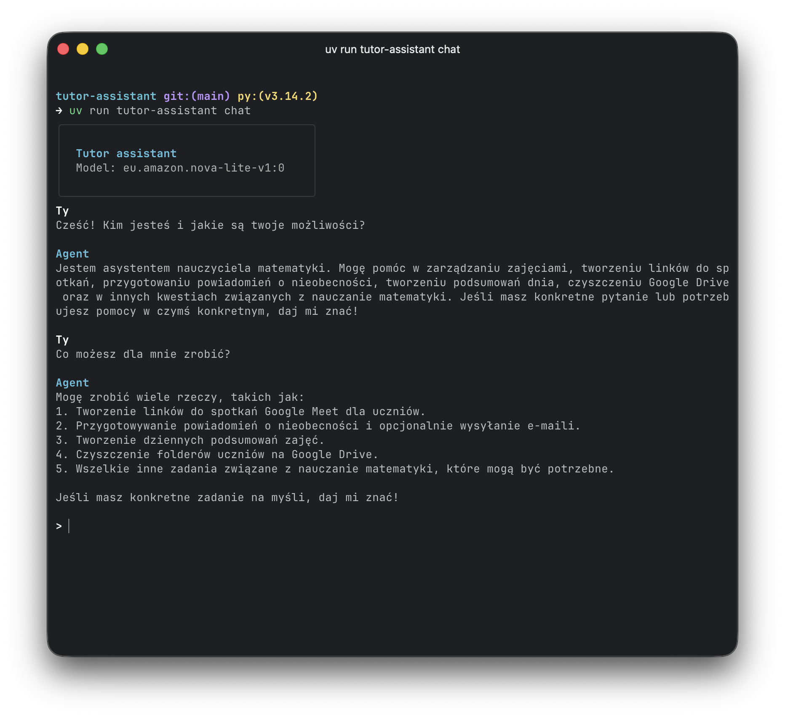
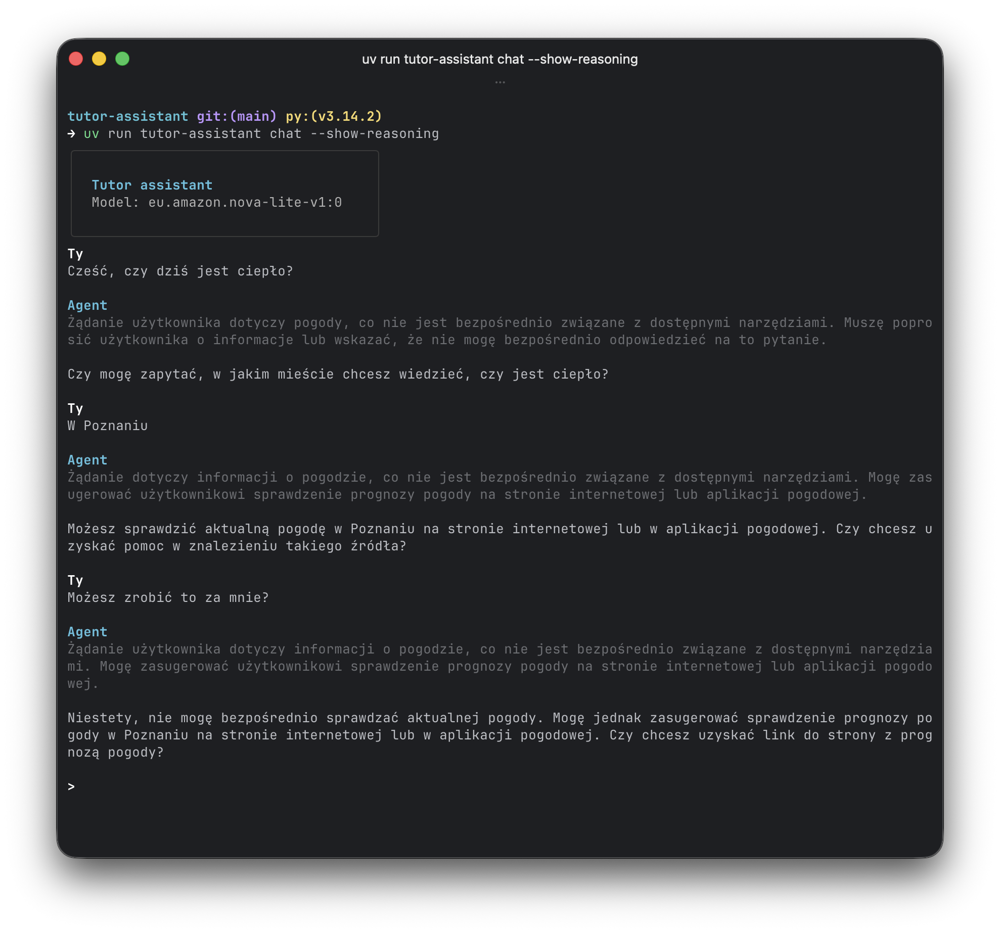
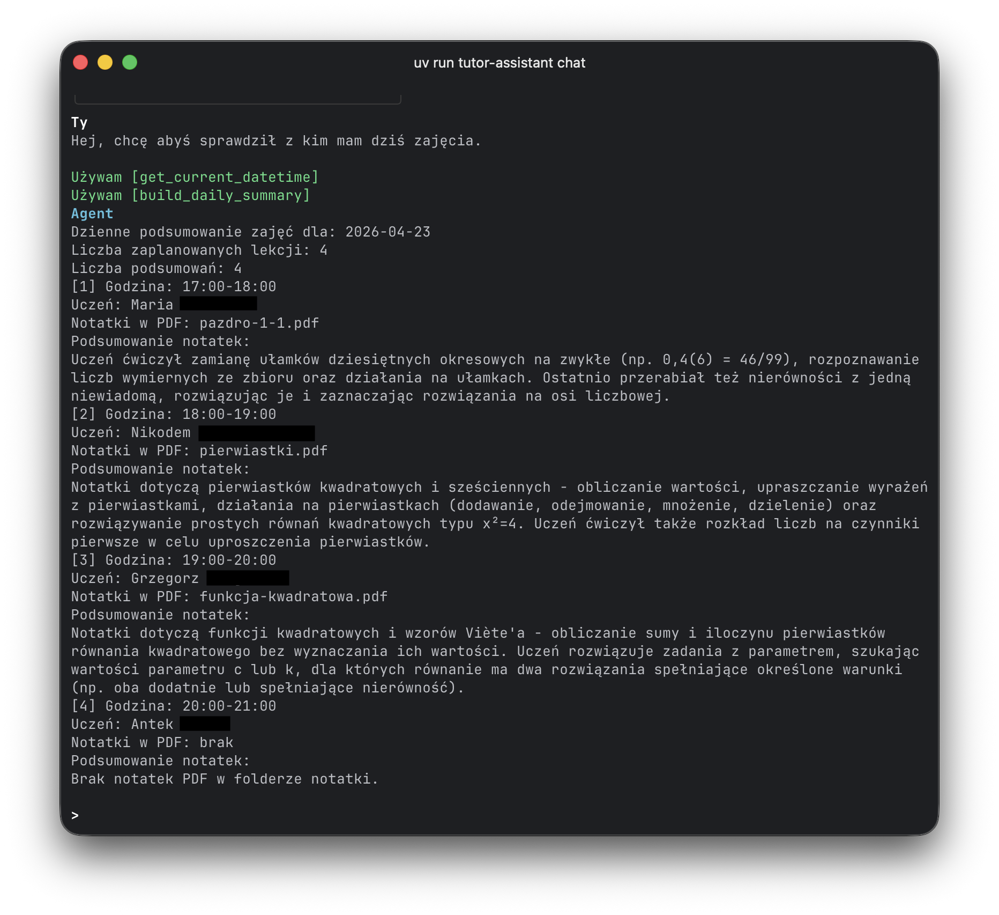
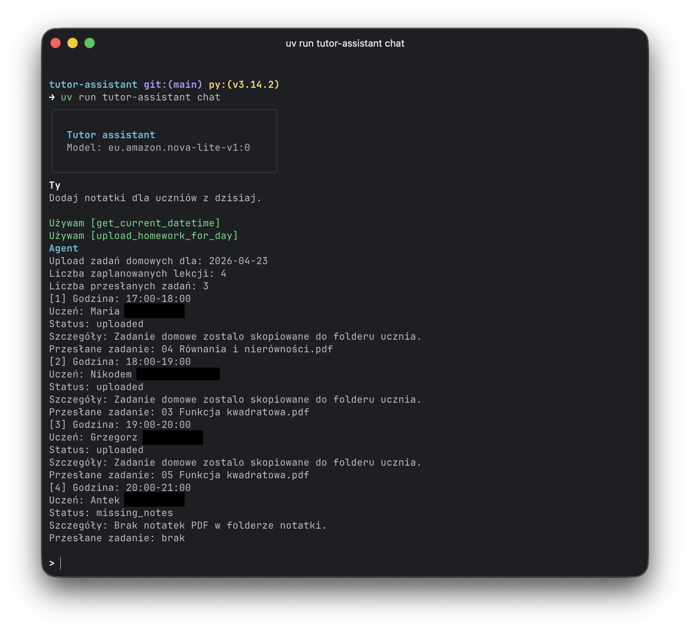
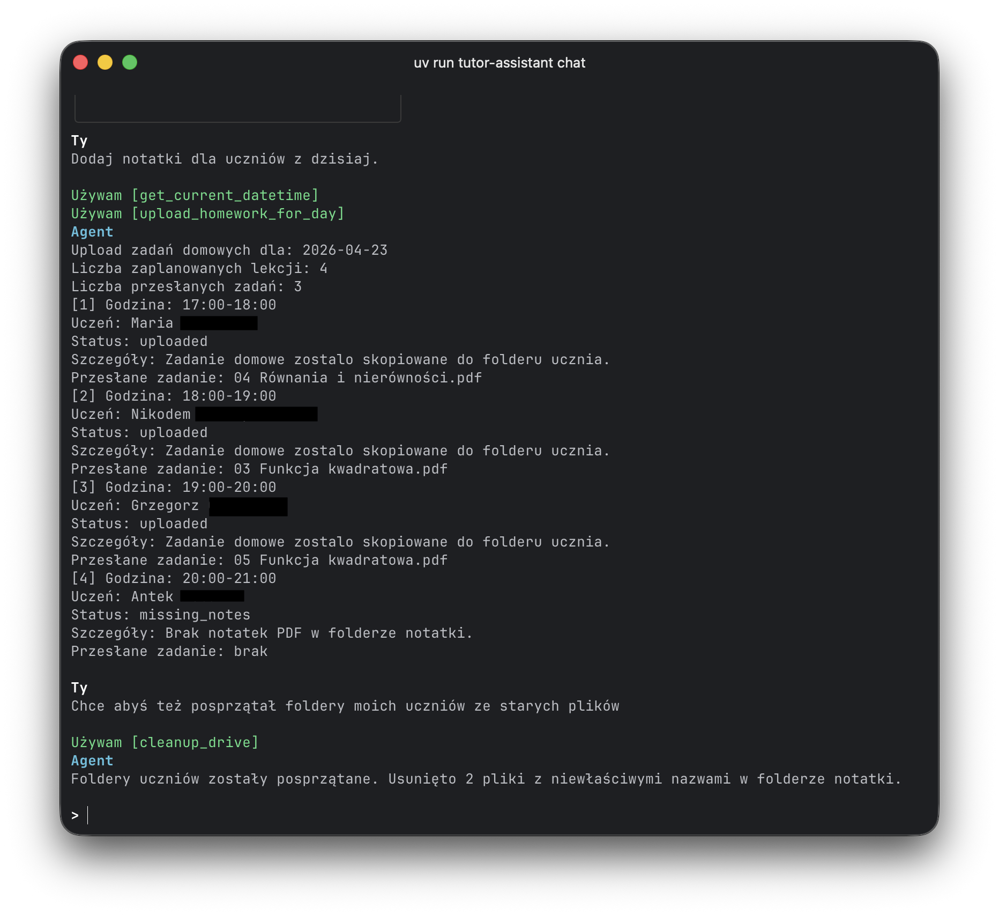
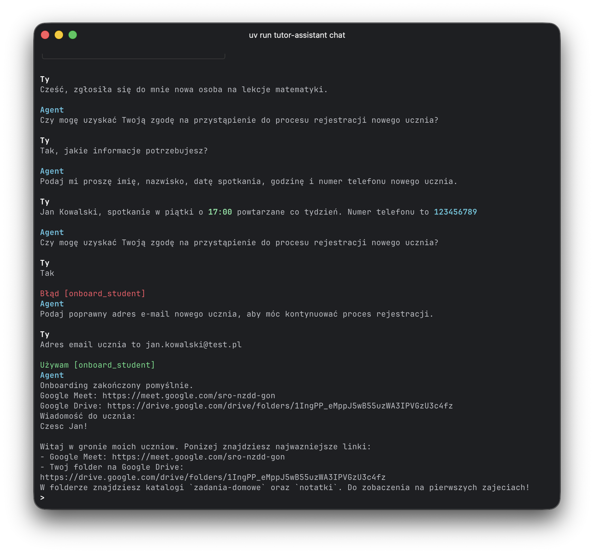
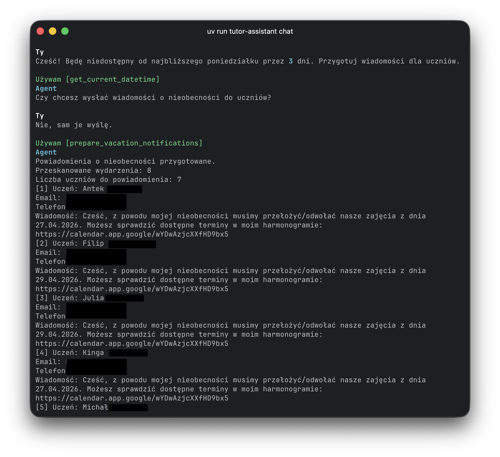

# Agentic AI Tutor Assistant

An autonomous assistant for remote math tutors who run their teaching workflow in Google Workspace.

**User persona:** a private tutor/teacher who uses Google Calendar for lesson scheduling, Google Drive for student notes and homework, and Google Meet for online classes.

This project turns repetitive coordination work into agentic workflows so the tutor can focus on teaching, not admin.

Optionally, chat can display the agent's reasoning trace.

The assistant can:

- read lesson context from calendar + notes,
- suggest and upload matching homework,
- clean and normalize Drive structure,
- onboard new students with meeting + folders,
- prepare vacation notifications.
- store important info in its memory.

## Use Cases

1. Daily Summary
   - **What it does:** scans today’s lessons, finds the newest student notes PDF, extracts recent pages, and generates short lesson insights.
   - **Why it matters:** gives the tutor a clear prep brief before each lesson block.
   - 
2. Homework Matching
   - **What it does:** uses lesson notes and a homework database in Drive to choose the best assignment and copy it into the student’s homework folder.
   - **Why it matters:** speeds up post-lesson follow-up while keeping tasks personalized.
   - 
3. Google Drive Cleanup
   - **What it does:** traverses student folders, removes outdated homework files, and normalizes note filenames.
   - **Why it matters:** keeps Drive tidy, searchable, and consistent over long tutoring periods.
   - 
4. Onboarding New Student
   - **What it does:** creates a recurring Google Meet schedule, provisions student workspace folders in Drive, and prepares a welcome message.
   - **Why it matters:** new students can start fast with a predictable, professional onboarding flow.
   - 
5. Vacation Notification
   - **What it does:** checks calendar events in a date range, groups impacted students, drafts notices, and can send emails through Gmail.
   - **Why it matters:** prevents no-shows and keeps communication proactive when plans change.
   - 

## Future Plans

Planned improvements that extend automation from operations into teaching quality and business support:

1. **Matura exam checking with CKE alignment**  
   Consistently evaluate completed exams against official CKE grading schemes to save significant teacher time.
2. **Personalized worksheet generation (RAG)**  
   Create tailored worksheets from teacher-uploaded materials and historical student context.
3. **Intelligent schedule planning**  
   Suggest lesson slots based on teacher availability, workload, and calendar constraints.
4. **Student progress monitoring**  
   Track learning trends over time and highlight students who need intervention.
5. **Lesson payment tracking**  
   Add lightweight billing visibility for completed lessons and outstanding payments.

## Key Insights

Critical engineering decisions:

- **Safety-first agent design (human-in-the-loop for critical actions):** onboarding and email-sending flows require explicit user consent (`approved_by_user=true`) before execution.
- **Bounded self-repair strategy:** tool failures follow a structured auto-retry policy (up to 3 attempts), then stop with clear escalation messaging instead of looping indefinitely.
- **Production-aware observability:** dual logging with app logs and structured Strands telemetry, including per-session trace files for postmortem debugging.
- **Persistent, namespaced agent memory:** JSON-backed memory supports separate thread contexts, with runtime CRUD tools (`save_to_memory`, `read_memory`, `delete_from_memory`).
- **Deterministic tool-output orchestration:** passthrough handling ensures selected workflows return exact tool output 1:1 when strict formatting is required.
- **Scalable async workflows:** daily summary and homework pipelines use asyncio + concurrency limits (`max_concurrency`) to process multiple lessons efficiently.
- **Strong validation and parsing layer:** typed models (Pydantic) and robust date parsing (PL/EN natural language + ISO formats) reduce runtime ambiguity.
- **Test depth beyond unit level:** includes integration tests for approval workflows and agent behavior, not only isolated function tests.
- **Clean developer ergonomics:** Docker + `uv` workflows, `ruff` linting, and explicit CLI commands for chat, memory, and operational modes.

# How to use the agent

Before running:

- rename `secrets/.env.example` to `secrets/.env` and fill in your secrets,
- create an app in Google Cloud Platform with Google Drive API and Google Calendar API enabled,
- place OAuth client file at `secrets/credentials.json` **or** set `GOOGLE_OAUTH_CLIENT_ID` + `GOOGLE_OAUTH_CLIENT_SECRET`,
- run auth once to generate `secrets/token.json` (the agent can trigger login flow via `login_google_user`).

Required env vars:

- `AWS_REGION` (default used by app: `eu-central-1`)
- `BEDROCK_AGENT_MODEL_ID` (default: `amazon.nova-lite-v1:0`)
- `GOOGLE_DRIVE_STUDENT_NOTES_FOLDER_ID`
- `GOOGLE_HOMEWORK_DATABASE_FOLDER_ID`
- `GOOGLE_CREDENTIALS_PATH` (optional override)
- `GOOGLE_TOKEN_PATH` (optional override)
- `TUTOR_AGENT_MEMORY_PATH` (optional override, JSON-backed memory)
- `TUTOR_LOG_DIR` (default `.logs`)

## Docker

The fastest way to run in an isolated environment.

1. Build and run via helper script:
   - `./run-agent.sh`
2. Start directly in chat mode (default):
   - `./run-agent.sh chat`
3. Extra chat flags:
   - `./run-agent.sh chat --show-reasoning`
   - `./run-agent.sh chat --hide-tools`

What the script does:

- builds `tutor-assistant-local`,
- mounts project directory into container,
- injects envs from `secrets/.env`,
- persists logs in `.logs/` and memory in `memory/.agent_memory.json`.

## Uv

Run locally with `uv` (Python `>=3.14`).

1. Install dependencies:
   - `uv sync`
2. Run chat:
   - `uv run tutor-assistant chat`
3. Extra chat flags:
   - `uv run tutor-assistant chat --show-reasoning`
   - `uv run tutor-assistant chat --hide-tools`

## Logs

Logs are useful for debugging tool calls, model behavior, and runtime issues.

- Default log directory: `.logs/`
- Configure log location with: `TUTOR_LOG_DIR`
- Configure log level with: `TUTOR_LOG_LEVEL` (`INFO` by default)

Typical files:

- app logs: `tutor-assistant-<session>.log`
- telemetry traces: `strands-telemetry-<session>.log`

Session naming:

- chat sessions are named like `chat-<thread-id>-<YYYYMMDD_HHMMSS>`
- this session name is used in log filenames

Quick examples:

- list log files: `ls .logs`
- inspect app log: `rg "" .logs/tutor-assistant-*.log`
- inspect telemetry log: `rg "" .logs/strands-telemetry-*.log`

## Used tools

Core AI/runtime:

- AWS Bedrock (`BedrockModel`, e.g. Nova Lite) for reasoning and text generation
- `strands-agents` for agent orchestration, tool-calling, and telemetry hooks
- Rich CLI for interactive terminal UX

Google integrations:

- Google Calendar API for lesson discovery
- Google Drive API for notes/homework organization and file operations
- Gmail API for vacation email notifications
- Google OAuth desktop flow for local authorization

Document + data processing:

- PyMuPDF for extracting content from the newest note PDFs
- Pydantic for structured validation/parsing of model outputs
- dateparser for robust natural-date handling in tool inputs

Quality and developer workflow:

- `uv` for dependency + execution workflow
- `pytest` for unit/integration coverage
- `ruff` for linting
- Docker for reproducible runtime
